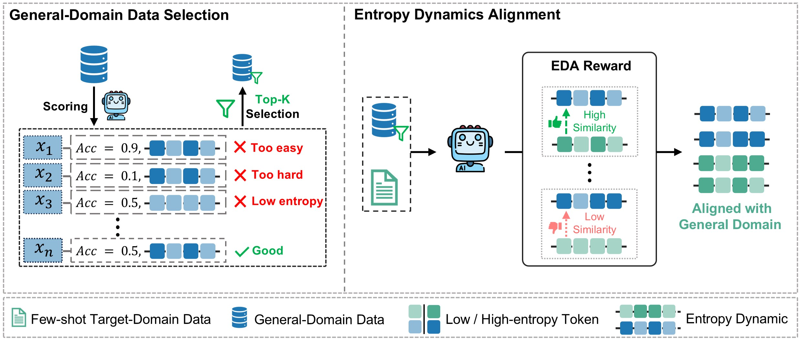

<div align="center">

# HEALing Entropy Collapse: Enhancing Exploration in Few-Shot RLVR via Hybrid-Domain Entropy Dynamics Alignment

<div align="center">
  
  <p><em>Overview of our proposed HEAL framework. Left: We incorporate a small set of high-value general-domain data into few-shot RLVR to promote diverse exploration and mitigate entropy collapse in the target domain. Right: Entropy Dynamics Alignment reward guides the policy by aligning the trajectory-level entropy dynamics of few-shot target-domain data with those of the selected general-domain data, thereby further encouraging controlled increases in entropy and more diverse exploratory behaviors.</em></p>
</div>

</div>

## Updates
* 06/04/2026: 🎉 Accepted by ACL 2026 Main Conference
* 25/03/2026: 🎉 We’re thrilled to release the HEAL! The [code](https://github.com/XMUDeepLIT/HEAL) are now open to the community.


## Setup

Our training pipeline is adapted from [verl](https://github.com/volcengine/verl). We follow verl's official installation guide to set up the environment (PyTorch, vLLM, etc.): https://verl.readthedocs.io/en/latest/start/install.html 

The installation commands that we verified as viable are as follows:
```bash
conda create -y -n heal python=3.10
conda activate heal

cd $your_path_to_heal
pip install -e .
pip install -r requirements.txt
pip install flash-attn --no-build-isolation
```

## Data

### Data download
```bash
cd $your_path_to_heal
cd data
bash download.sh
```

### Data preprocess
```bash
cd data_preprocess
bash data_preprocess.sh
```

### Custom data processing
If you have your own unique dataset, please refer to the data preprocessing script code I provided above or follow the tutorial in the link below to write your own custom data processing script.

https://verl.readthedocs.io/en/latest/preparation/prepare_data.html

## Training

### Configure the scripts

Before training, we can assign the configurations in the training scripts:
```bash
# inside your_path_to_heal/examples/grpo_trainer/*.sh
DATA_DIR=path-to-your-data-path
MODEL_DIR=path-to-your-base-model-path
project_name=your-custom-project-name
exp_name=your-custom-exp-name
CHECKPOINTS_DIR_PREFIX=path-to-your-save-path
train_file_name=your-custom-train-file-name
val_file_name=your-custom-val-file-name

# if you want to train on code datasets, We recommend setting up the code sandbox according to the tutorial in the link https://verl.readthedocs.io/en/latest/sglang_multiturn/sandbox_fusion.html
SANDBOX_URL=your-custom-sandbox_url
```

### Launch training
```bash
cd $your_path_to_heal

# Vanilla GRPO few-shot baseline
bash examples/grpo_trainer/run_qwen3_fewshot.sh

# Vanilla GRPO few-shot baseline
bash examples/grpo_trainer/run_qwen3_hybrid_naive.sh

# HEAL GRPO
bash examples/grpo_trainer/run_qwen3_heal.sh
```

## Evaluation

### Before Evaluation
After training, the checkpoint files need to be merged into Hugging Face format so that they can be read by the evaluation script.
```bash
cd $your_path_to_heal
bash merge.sh
```

### Eval on Single Answer Benchmarks
If your test dataset only consists of simple questions with short single answers, we recommend using the [Qwen2.5-Math](https://github.com/QwenLM/Qwen2.5-Math) repository for model evaluation. Please refer to the tutorial in that code repository for details.


### Eval on Code Benchmarks
Please refer to [LiveCodeBench](https://github.com/LiveCodeBench/LiveCodeBench) and [Evalplus](https://github.com/evalplus/evalplus).

## Acknowledgements
- Our training experiments are powered by a modified fork of [verl](https://github.com/volcengine/verl).
- Our evaluation experiments are based on a modified fork of [Qwen2.5-Math](https://github.com/QwenLM/Qwen2.5-Math), [LiveCodeBench](https://github.com/LiveCodeBench/LiveCodeBench) and [Evalplus](https://github.com/evalplus/evalplus).

We also utilize vLLM for efficient inference and build our training upon Qwen3 as the backbone model.

  
## Citation
```bibtex
@article{liu2026heal,
  title={HEALing Entropy Collapse: Enhancing Exploration in Few-Shot RLVR via Hybrid-Domain Entropy Dynamics Alignment},
  author={Zhanyu Liu and Qingguo Hu and Ante Wang and Chenqing Liu and Zhishang Xiang and Hui Li and Delai Qiu and Jinsong Su},
  journal={arXiv preprint arXiv:},
  year={2026}
}
```
